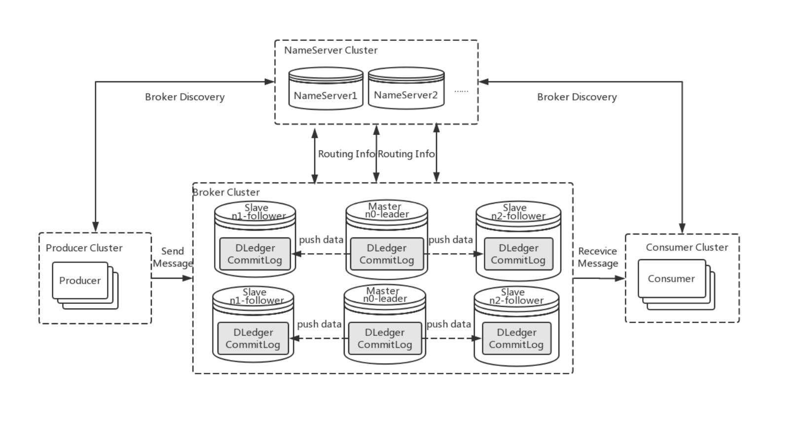

## RocketMQ服务部署情况介绍

由于项目对消息的可靠性要求比较高所以采用的是**SYNC_MASTER+SLAVE**的部署方式,
并且使用了**ASYNC_FLUSH（同步刷新）**机制，虽然Master节点宕机的时候会丢失一部分的消息数据，但是性能上是很大的提升；

根据官方说明的优缺点：

 - 优点：数据与服务都无单点故障，Master宕机情况下，消息无延迟，服务可用性与数据可用性都非常高；
 - 缺点：性能比异步复制模式略低（大约低10%左右），发送单个消息的RT会略高，且目前版本在主节点宕机后，备机不能自动切换为主机（针对4.5以前的版本）。
 
由于我们使用的是`4.7.0`版本已经使用了**raft 协议**解决了这个问题。如果要使集群能够自动容灾切换，需要至少三台机器

我们一共有4台机器，每台机器的配置：

    32g内存，2T的硬盘，8核CPU

一台机器作为nameserver，其余都是broker，broker之间可以进行自动选举master节点

部署情况：

配置文件编写情况：

    #所属集群名字
    brokerClusterName=RaftCluster
    brokerName=RaftNode00
    ## 启用DLeger
    enableDLegerCommitLog=true
    dLegerGroup=RaftNode00
    dLegerPeers=n0-127.0.0.1:40911;n1-127.0.0.1:40912;n2-127.0.0.1:40913
    dLegerSelfId=n0
    #0 表示 Master，>0 表示 Slave
    brokerId=0
    #nameServer地址，分号分割
    namesrvAddr=rocketmq-nameserver-0:9876
    autoCreateTopicEnable=false
    autoCreateSubscriptionGroup=false
    #Broker 对外服务的监听端口，10911为默认值
    listenPort=10911
    #表示Master监听Slave请求的端口,默认为服务端口+1
    haListenPort=10912
    #- SLAVE
    brokerRole=ASYNC_MASTER
    #刷盘方式
    flushDiskType=ASYNC_FLUSH

## RocketMQ消费端设置情况

Consumer使用的是公司封装的所以能够配置的参数有限，通过阅读封装的代码发现，

`consumeMessageBatchMaxSize=10`一批次可以处理10条数据
`setConsumeThreadMin=3`后面修改为了CPU核心数
`setConsumeThreadMax=3`后面修改为了CPU核心数
`setMessageModel=MessageModel.CLUSTERING` 集群模式
`setConsumeFromWhere=ConsumeFromWhere.CONSUME_FROM_LAST_OFFSET` 接着上次消费的进度开始消费

其余的参数都没有进行改动

## RocketMQ消息堆积了如何解决

原因：消费服务太慢导致消息堆积；

这里的堆积指的是Consumer拉取的消息消费不过来了导致的堆积

我们的系统中使用的是PUSH的消费模式，本质上是使用PULL不断的向Broker拉取消息机制的封装。

解决办法：

 - 先修复 consumer 的问题，确保其恢复消费速度，然后将现有 consumer 都停掉。（因为历史数据积压太多，短时间内无法消费完）
 - 建立新的topic，临时建立好原先 10 倍的 queue 数量。
 - 然后写一个临时的分发数据的 consumer 程序，这个程序部署上去消费积压的数据，消费之后不做耗时的处理，直接均匀轮询写入临时建立好的 10 倍数量的 queue
 - 接着临时征扩容机器机器来部署 consumer，每一批 consumer 消费一个临时 queue 的数据。
 - 等快速消费完积压数据之后，得恢复原先部署的架构，重新用原先的 consumer 机器来消费消息。
